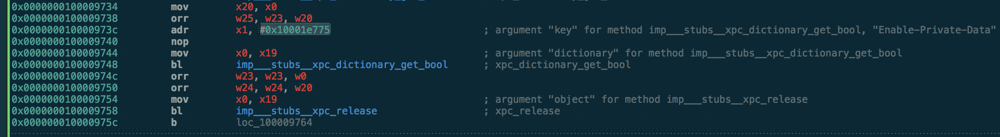

## Unredacting `<private>` `os_log()` messages on iOS.

**tldr:** Save `com.apple.system.logging.plist` inside of `/Library/Preferences/Logging/` and execute `killall logd`.

#### Discovery
The motivation for finding this came while working on a project that deals with resigning applications and installing them to a device. When trying to install an application that holds invalid entitlements, `installd` would produce the following log message:
`entitlement <private> has value not permitted by provisioning profile <private>`. Seeing the real contents of this message would greatly reduce the amount of time I spent debugging entitlements.

`logd` seems like the obvious first place to start looking. Pull the binary off of a jailbroken iOS device and throw it in a disassembler. The goal is to remove `<private>`; searching for string references of `private` shows promising results, specifically `Enable-Private-Data`.

It has only 1 cross-reference, a function located at `0x100009648`. This function is a part of the initialization of the system's default logger. The usage of the string hints at it being a preference key. 

`Enable-Private-Data` is loaded into register `x1` from address `0x10001e775`, to be used as the second argument in a branch to function `xpc_dictionary_get_bool()`. The result is used later on in the continued creation of the default logger. We need to set this key to `TRUE` to enable logging of `<private>` items. 

 
 Looking into the documentation for `xpc_dictionary_get_bool()`, the first argument is the dictionary containing the target key:
 `bool xpc_dictionary_get_bool(xpc_object_t xdict, const char *key);`
 
Directly before the branch to this function, register `x0` is populated from `x19`, which we can assume contains the `xpc_object_t` representation of the dictionary that we need to modify. How does this get created?

It's easier to read what this is doing backwards, from the bottom to the top. `x19` is populated via a branch to `_os_trace_read_plist_at()`, using the return value of the `snprintf_chk()` branch performed at `0x1000096e8`. At `0x1000096cc` we can see the format string to be used, `%s/%s.plist`. Just above that are the values to be used to populate it: the return value of ` _os_trace_prefsdir_path()` and the string `com.apple.system.logging`. `_os_trace_prefsdir_path()` is implemented in `libSystem.dylib` and returns string `/Library/Preferences/Logging/`.

With this, this full plist path can be constructed: `/Library/Preferences/Logging/com.apple.system.logging.plist`. It seems all we need to do is create a plist file at this path, containing a bool key `Enable-Private-Data` with value of `TRUE`. Could it be that simple?

Yep.
--
Some problems can only be solved by reverse engineering, but that doesn't mean they aren't simple. 
